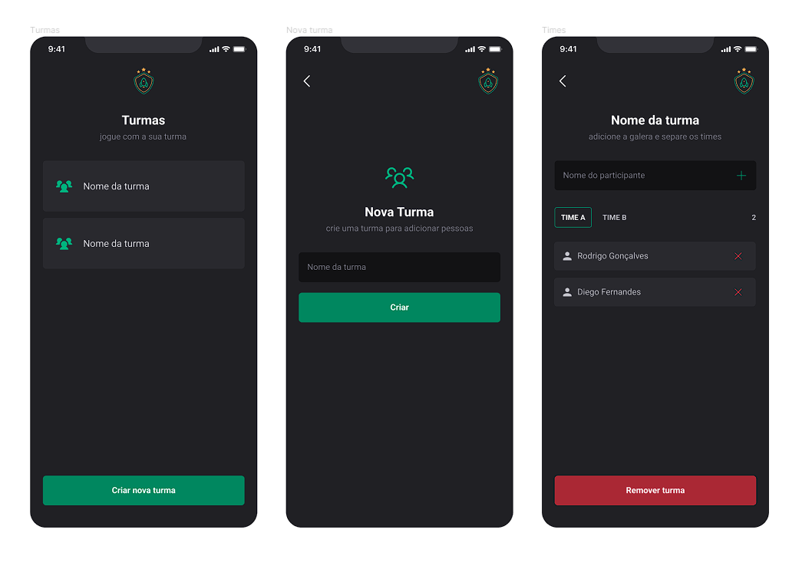

# IgniteTeams 🎮📱

IgniteTeams é um aplicativo móvel construído com React Native, Expo e TypeScript, projetado para ajudar equipes a gerenciar suas tarefas e projetos com mais eficiência.

## Instalação

Para instalar o IgniteTeams, siga estes passos:

1. Clone este repositório
2. Execute o comando `npm install` para instalar as dependências necessárias
3. Execute o comando `expo start` para iniciar o aplicativo

## Tecnologias usadas

O IgniteTeams foi construído utilizando as seguintes tecnologias:

- React Native
- Expo
- TypeScript
- Styled Components
- React Navigation
- Phosphor Icons
- React Native SVG
- Async Storage
- Expo Font
- Babel Plugin Module Resolver

## Figma
[Acesse o Figma do IgniteTeams](https://www.figma.com/community/file/1151864427495057381)

## Licença

Este projeto está licenciado sob a Licença MIT.
